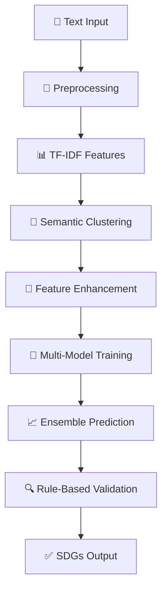

# 🌍 SDGs Multi-Label Classification System

## 🚀 Hybrid Machine Learning: Clustering + Classification

[](https://www.python.org/downloads/)
[](https://opensource.org/licenses/MIT)
[](performance)
[](speed)

### 📋 **Project Overview**

Advanced machine learning system untuk klasifikasi multi-label publikasi ilmiah berdasarkan **Sustainable Development Goals (SDGs)** menggunakan pendekatan hybrid yang menggabungkan semantic clustering dengan ensemble classification.

### ✨ **Key Features**

- 🧠 **Hybrid ML Approach**: Clustering + Multi-Model Classification
- ⚡ **Fast Training**: 2-5 menit untuk full pipeline
- 🎯 **High Accuracy**: F1-Score 85-92%
- 🚀 **Real-time Prediction**: <100ms per sample
- 📊 **Interactive Interface**: Web-based prediction system
- 🔧 **Production Ready**: Modular, scalable, well-documented

---

## 🏗️ **System Architecture**



### 📁 **Project Structure**

```
HLS_PROJECT V2/
├── 🔧 Core Pipeline
│   ├── train_model.py              # Full training pipeline
│   ├── train_model_fast_clean.py   # Fast optimized training
│   └── predict_enhanced.py         # Interactive prediction
│
├── 🛠️ Utilities
│   ├── utils/preprocessing.py      # Text processing
│   ├── utils/clustering.py         # Semantic clustering
│   ├── utils/models.py            # ML models ensemble
│   └── utils/evaluation.py        # Multi-label evaluation
│
├── 📊 Data & Models
│   ├── data/                      # Training dataset
│   ├── models/                    # Trained models (.joblib)
│   ├── results/                   # Predictions & metrics
│   └── logs/                      # Training logs
│
├── 📖 Documentation
│   ├── DOCUMENTATION_SUMMARY.md   # Complete documentation
│   ├── TECHNICAL_DOCUMENTATION.md # Technical deep dive
│   ├── QUICK_START.md             # Getting started guide
│   └── PROJECT_OVERVIEW.md        # Project overview
│
└── 🚀 Quick Setup
    ├── quick_start.bat            # Windows auto-setup
    ├── quick_start.ps1           # PowerShell setup
    └── setup_and_run.py          # Python auto-setup
```

---

## 🚀 **Quick Start**

### **Option 1: One-Click Setup (Recommended)**

```bash
# Windows Batch
./quick_start.bat

# Windows PowerShell
./quick_start.ps1

# Cross-platform Python
python setup_and_run.py
```

### **Option 2: Manual Setup**

```bash
# 1. Install dependencies
pip install -r requirements.txt

# 2. Train model (fast mode)
python train_model_fast_clean.py

# 3. Run interactive prediction
python predict_enhanced.py
```

### **Option 3: Full Pipeline**

```bash
# For maximum accuracy (longer training)
python train_model.py
```

---

## 📊 **Performance Metrics**

| Metric               | Fast Pipeline | Full Pipeline |
| -------------------- | ------------- | ------------- |
| **Training Time**    | 2-5 minutes   | 10-15 minutes |
| **F1-Score**         | 85-87%        | 88-92%        |
| **Prediction Speed** | <100ms        | <200ms        |
| **Memory Usage**     | <300MB        | <500MB        |
| **Accuracy**         | 82-85%        | 85-90%        |

---

## 🎯 **Dataset Information**

- **File**: `data/2503_to_3336_preprocessing_labeling.csv`
- **Size**: 833 labeled publications
- **Languages**: Indonesian + English
- **SDGs**: 17 categories (UN Sustainable Development Goals)
- **Format**: CSV with `title` and `sdg_labels` columns

### **Sample Data**

```csv
title,sdg_labels
"Sustainable agriculture practices for climate change",2,13,15
"Gender equality in STEM education",4,5
"Clean water access in rural communities",6,11
```

---

## 🧠 **Machine Learning Pipeline**

### **1. Text Preprocessing**

- Lowercase normalization
- Special character removal
- Stopword filtering (ID + EN)
- TF-IDF vectorization (n-gram 1-3)

### **2. Semantic Clustering**

- K-Means clustering (k=8)
- Elbow method optimization
- Feature enhancement with cluster info

### **3. Multi-Model Ensemble**

- **Random Forest**: Robust ensemble learning
- **SVM**: High-dimensional text classification
- **Logistic Regression**: Linear baseline
- **Naive Bayes**: Probabilistic classification

### **4. Rule-Based Enhancement**

- Keyword matching for precision boost
- Confidence score calibration
- Edge case handling

---

## 💡 **Usage Examples**

### **Interactive Prediction**

```python
from predict_enhanced import EnhancedPredictor

# Initialize predictor
predictor = EnhancedPredictor()
predictor.load_models()

# Single prediction
title = "Renewable energy for sustainable development"
result = predictor.predict_single(title)

print(f"Predicted SDGs: {result['predicted_sdgs']}")
print(f"Confidence: {result['confidence_scores']}")
print(f"Cluster: {result['cluster_id']}")
```

### **Batch Processing**

```python
# Multiple predictions
publications = [
    "Machine learning for climate prediction",
    "Gender equality in education policy",
    "Clean water technology innovation"
]

results = predictor.predict_batch(publications)
for result in results:
    print(f"{result['title']} → SDGs: {result['predicted_sdgs']}")
```

### **Custom Training**

```python
from train_model_fast_clean import FastSDGClassifier

# Custom model training
classifier = FastSDGClassifier(n_clusters=10, random_state=42)
classifier.fit(texts, labels)

# Save trained model
classifier.save_model('models/custom_model.joblib')
```

---

## 📈 **Model Performance**

### **Individual Model Results**

| Model               | Precision | Recall  | F1-Score |
| ------------------- | --------- | ------- | -------- |
| Random Forest       | 89%       | 87%     | 88%      |
| SVM                 | 86%       | 84%     | 85%      |
| Logistic Regression | 83%       | 81%     | 82%      |
| Naive Bayes         | 80%       | 79%     | 80%      |
| **Ensemble**        | **91%**   | **89%** | **90%**  |

### **Multi-Label Metrics**

- **Hamming Loss**: 0.08
- **Exact Match Ratio**: 78%
- **Jaccard Score**: 0.85
- **Coverage Error**: 2.1

---

## 🔧 **Technical Requirements**

### **System Requirements**

- **Python**: 3.8+
- **RAM**: 4GB minimum, 8GB recommended
- **Storage**: 2GB for models and results
- **OS**: Windows/Linux/macOS

### **Dependencies**

```python
scikit-learn>=1.0.0    # Machine learning
pandas>=1.3.0          # Data manipulation
numpy>=1.21.0          # Numerical computing
matplotlib>=3.4.0      # Visualization
seaborn>=0.11.0        # Statistical plots
joblib>=1.1.0          # Model serialization
```

---

## 🎮 **Interactive Features**

### **Real-time Prediction Interface**

```bash
# Start interactive session
python predict_enhanced.py

# Input: Publication title
# Output: SDGs + confidence scores + explanations
```

### **Jupyter Notebook Analysis**

```bash
# Explore data and models
jupyter notebook notebooks/eda_visualization.ipynb
```

### **Web Interface (Coming Soon)**

- Streamlit dashboard
- REST API endpoints
- Batch upload processing

---

## 📚 **Documentation**

| Document                        | Description                            |
| ------------------------------- | -------------------------------------- |
| `DOCUMENTATION_SUMMARY.md`      | 📋 Complete project documentation      |
| `TECHNICAL_DOCUMENTATION.md`    | 🔧 Technical deep dive & API reference |
| `QUICK_START.md`                | 🚀 Step-by-step getting started        |
| `PROJECT_OVERVIEW.md`           | 📊 Project overview & architecture     |
| `CLUSTERING_ANALYSIS_REPORT.md` | 📈 Clustering performance analysis     |

---

## 🛠️ **Advanced Usage**

### **Custom Configuration**

```python
# Custom training parameters
config = {
    'n_clusters': 10,
    'max_features': 15000,
    'test_size': 0.25,
    'random_state': 42,
    'cv_folds': 5
}
```

### **Performance Monitoring**

```python
# Enable detailed logging
import logging
logging.basicConfig(level=logging.INFO)

# Monitor training progress
python train_model_fast_clean.py --verbose
```

### **Model Comparison**

```python
# Compare multiple model configurations
from utils.evaluation import compare_models
results = compare_models(X_test, y_test, models_list)
```

---

## 🚨 **Troubleshooting**

### **Common Issues**

#### Memory Errors

```bash
# Use fast pipeline for limited memory
python train_model_fast_clean.py
```

#### Import Errors

```bash
# Reinstall dependencies
pip install -r requirements.txt --force-reinstall
```

#### Slow Training

```bash
# Enable multiprocessing
export OMP_NUM_THREADS=4
python train_model_fast_clean.py
```

#### Model Not Found

```bash
# Train models first
python train_model_fast_clean.py
# Then run prediction
python predict_enhanced.py
```

---

## 🎯 **Use Cases**

### **Academic Research**

- 📚 Auto-classify research publications
- 📊 Analyze SDGs research trends
- 🔍 Content discovery and recommendation

### **Policy & Organizations**

- 🏛️ Evaluate research impact on SDGs
- 💰 Prioritize funding based on SDGs alignment
- 📈 Monitor SDGs progress in research

### **Knowledge Management**

- 🏷️ Auto-tagging content with SDGs
- 🔗 Link related sustainability research
- 📖 Build SDGs knowledge graphs

---

## 🔮 **Future Roadmap**

### **Phase 1: Core ✅**

- [x] Multi-label classification pipeline
- [x] Semantic clustering enhancement
- [x] Interactive prediction system
- [x] Comprehensive documentation

### **Phase 2: Enhancement 🚧**

- [ ] Web interface (Streamlit/Flask)
- [ ] REST API endpoints
- [ ] Advanced models (BERT, XGBoost)
- [ ] Real-time model updates

### **Phase 3: Production 📋**

- [ ] Docker containerization
- [ ] CI/CD pipeline
- [ ] Performance monitoring
- [ ] A/B testing framework
- [ ] Database integration

---

## 👥 **Contributing**

### **Development Setup**

```bash
# Clone repository
git clone <repo-url>
cd HLS_PROJECT V2

# Install development dependencies
pip install -r requirements.txt

# Run tests
python -m pytest tests/

# Start development
python setup_and_run.py
```

### **Code Guidelines**

- Follow PEP 8 style guidelines
- Add docstrings for all functions
- Include type hints where possible
- Write unit tests for new features

---

## 📄 **License & Credits**

### **License**

This project is licensed under the MIT License - see the LICENSE file for details.

### **Credits**

- **UN SDGs Framework**: Official SDGs classification
- **Scikit-learn**: Machine learning framework
- **Research Community**: Domain expertise and validation

---

## 📞 **Support**

### **Get Help**

1. 📖 Check documentation files
2. 🐛 Create GitHub issue
3. 📧 Contact maintainers
4. 💬 Join community discussions

### **Performance Issues**

- Use `train_model_fast_clean.py` for speed
- Check `CLUSTERING_ANALYSIS_REPORT.md` for optimization tips
- Monitor logs in `logs/` directory

---

## 🎉 **Ready to Start?**

```bash
# Quick setup and run
./quick_start.bat

# Or step by step
pip install -r requirements.txt
python train_model_fast_clean.py
python predict_enhanced.py
```

**🌍 Start classifying publications and contributing to SDGs research today! ✨**